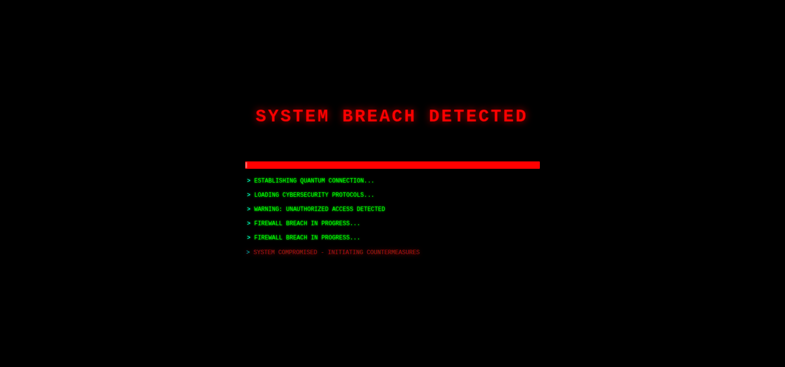
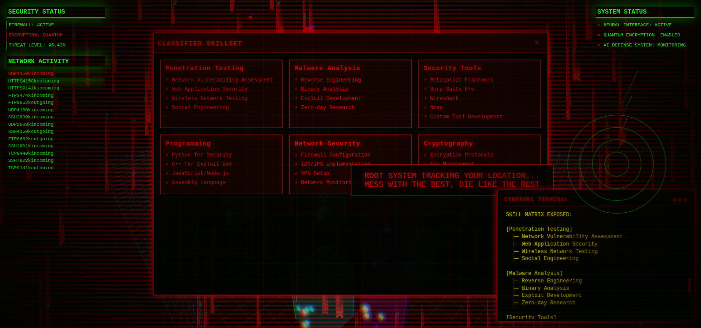

# NeonHack Nexus - Cyberpunk Portfolio

Welcome to my cyberpunk-themed portfolio website! This project showcases my skills and experience through an immersive, interactive cyberpunk interface.




## 🌟 Features

- **Cyber City 3D Environment**: Immersive 3D cityscape visualization
- **Neural Network Visualization**: Interactive neural network representation
- **Matrix Rain Effect**: Classic cyberpunk matrix rain animation
- **Hologram Projects**: Project showcase with holographic effects
- **Jarvis-style HUD**: Advanced heads-up display interface
- **Cyber Terminal**: Interactive command-line interface
- **Quantum Particle Effects**: Dynamic particle system
- **Resume Viewer**: Integrated PDF resume viewer
- **Tracking Sequence**: Dynamic tracking animations
- **Skill Node System**: Visual representation of technical skills

## 🚀 Technologies Used

- React + Vite
- Three.js for 3D graphics
- SCSS for styling
- Custom animations and effects
- PDF rendering
- Docker support

## 🛠️ Installation

1. Clone the repository:
```bash
git clone https://github.com/yourusername/neonhack-nexus.git
cd neonhack-nexus
```

2. Install dependencies:
```bash
npm install
```

3. Run the development server:
```bash
npm run dev
```

The site will be available at `http://localhost:5173`

## 🐳 Docker Support

To run using Docker:

```bash
docker build -t neonhack-nexus .
docker run -p 3000:3000 neonhack-nexus
```
## 🔧 Development

To start development:

1. Fork the repository
2. Create a feature branch
3. Make your changes
4. Submit a pull request

